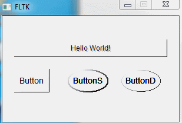

# FLTK Round Button
Round button for FLTK library 1.x.x. 

## New Properties
### Width of the button border
*void doubleBorder(bool doubleBorder)* sets border to think(true) or thin(false) line
*bool doubleBorder() const* returns the current border width

Here is an example of standard, double-bordered, and single-bordered buttons:

## Colors for dark and light border colors
Both colors are private properties and this implementation does not have methods to change or read them. It was fine for my project. If you need to change colors on the fly just add setters and getters for both colors.

*Fl_Color lineDarkColor* sets the dark border color - it is the color of bottom right of the border
*Fl_Color lineLightColor* sets the light border color - it is the color of top left of the border

Other points get color of the mix of these two colors. You are not limited with gray, white and black colors.